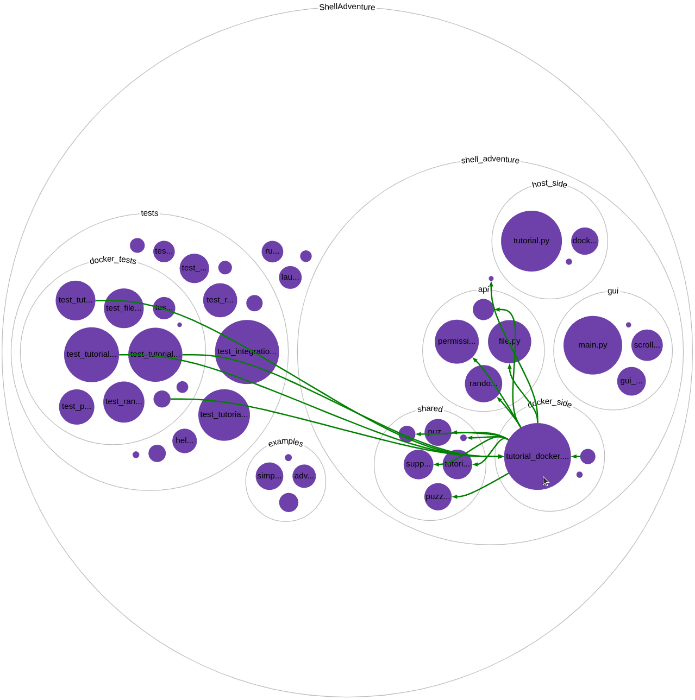

# CBRV - The CodeBase Relationship Visualizer

Understanding relationships between files and their directory structure is a fundamental part of the software
development process. However, it can be hard to grasp these relationships without a convenient way to visualize them and
how they fit into the directory structure of the codebase. CodeBase Relationship Visualizer (CBRV), is a Visual Studio
Code extension that interactively visualizes the relationships between files.

CBRV displays the relationships between files as arrows superimposed over a circle packing diagram of the codebase's
directory structure. The visualization is inspired by [Repo Visualizer](https://github.com/githubocto/repo-visualizer)
but interactive and zoomable.

CBRV comes bundled with visualizations of the stack trace path, a dependency graph for Python codebases, and a hyperlink
graph for HTML and Markdown. CBRV also exposes an API that can be used by other extensions to create visualizations for
different relationships.


# Usage

## Stack Trace Visualization


The command "Visualize the stack trace during a debugger session" brings up the Stack Trace Visualization.

This visualization displays the stack trace as a line over the directory structure diagram. Arrows jump between the
files in the current stack trace, displaying a line following the current path of execution though the code base. The
visualization is linked with the debugger in real time, as you step though the debugger the visualization will update to
match the current stack trace.

In the case of multithreading, multiple stack trace lines are rendered, each color-coded by thread. The extension is
only be able to show stack traces for threads that are currently stopped on a breakpoint in the debugger.

The visualization uses the [DAP](https://microsoft.github.io/debug-adapter-protocol/) to allow it to interface with most
VSCode debuggers.

## Dependency Visualization



The command "Visualize the dependencies between Python files" brings up the Dependency Visualization. This
visualization displays dependencies between files in Python codebases. It displays a directed arrow for any `import`s in
python files. It only show connections to/from a file on hover over that file by default. The visualization uses the
handy [pydeps](https://github.com/thebjorn/pydeps) package to extract the dependencies from the source files.

## Hyperlink Visualization


The command "Visualize a hyperlink graph" brings up the Hyperlink Visualization. This visualization uses the CBRV API
to display references between HTML and Markdown files. It displays a directed arrow for any `href` in an HTML document
or links in a Markdown document that reference another file in the workspace. The visualization only shows connection
to/from a file on hover over that file by default to prevent the visualization getting overly crowded.

# Extending CBRV
CBRV exposes an API that can be used to create your own VSCode extensions with visualizations of different relationships
between files. You can access the API in your extension by adding `jesse-r-s-hines.codebase-relationship-visualizer` to
your `package.json` `extensionDependencies` and then import the api like so:

```ts
let cbrvAPI = vscode.extensions.getExtension('jesse-r-s-hines.codebase-relationship-visualizer').exports;
let visualization = await cbrvAPI.create({
  // ...
})
```

See https://code.visualstudio.com/api/references/vscode-api#extensions for more info on importing extensions.

API docs are available at https://jesse-r-s-hines.github.io/CodeBaseRelationshipVisualizer. You can see examples of
using the API in the [src/visualizations](./src/visualizations/) folder.

# Development
To run the project from source run
```bash
npm ci
```
then open it up in VSCode and press `F5` to run and debug it.

To run the Python Dependency Graph visualization you'll need to have [Python3](https://www.python.org) installed.

On Windows, you'll want to enable git symlinks before you clone the repo, first enable "Developer Mode" in Windows
settings and then run
```bash
git config --global core.symlinks true
```

To build and run the tests run
```bash
npm run test
```
