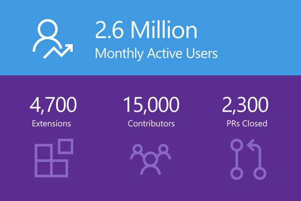

# Visual Studio Code at Connect(); 2017

November 15, 2017 Sean McBreen, [@nz_sean](https://twitter.com/nz_sean)

On the day of our annual developer conference ([tune in here](https://www.microsoft.com/en-us/connectevent) if you missed it), we thought it would be cool to reflect on a few things highlighted today and touch on some things that have happened for Visual Studio Code in the last 12 months, for example:

* Over 15,000 of you contributed to VS Code, making us the #1 project in the [2017 GitHub Octoverse](https://octoverse.github.com/).
* More than 2,600,000 people use VS Code every month, up by over 160% in the last year.

>

We have come a long way and a big reason is the amazing support we have from the community. We'd like to start with a big **THANK YOU!**

## Announcements and news from Connect();

At this year's Connect(); event, you'll see VS Code in the keynote, in general sessions, and in plenty of on-demand content.

Here are a few highlights:

* **Visual Studio Live Share** We showed a glimpse of the future with real-time collaborative editing and debugging in both VS Code and VS IDE - no need to clone a repo, copy code or configuration anything. Find out more on the [Visual Studio Live Share page](/visual-studio-live-share).

* **Java and Python support** - We're getting serious about [Python](/docs/languages/python) and [Java](/docs/languages/java) for VS Code by staffing full time teams.  There was a nice demo of this support in the Visual Studio General Session showing debugging of an Azure Java Function and running Python unit tests.

* **Debugging inside containers** - Containerized development is a great way to replicate your production environment, and work on multiple projects while keeping your development environment clean. With [the Docker extension](https://marketplace.visualstudio.com/items?itemName=ms-azuretools.vscode-docker), you can run `docker-compose` and automatically connect VS Code's debugger to a Node.js app running inside the container.

* **Work with Azure** - There are now extensions for [many Azure services](https://marketplace.visualstudio.com/search?target=VSCode&category=Azure&sortBy=Downloads), making tasks like deploying web apps, managing container registries and images, and working with databases a lot simpler.

There was a lot of VS Code activity at Connect(); but as we look back at the last 12 months, we also feel good about our pace in improving VS Code.

## The community and VS Code

Many of the new features have come from the community; through issues, pull requests, and though the creation of Extensions. We have seen a huge amount of progress and again we want to say **THANK YOU!**

* We processed over [2,300 PRs](https://github.com/microsoft/vscode/pulls?q=is%3Apr+is%3Aclosed).
* We closed over [30,000 issues](https://github.com/microsoft/vscode/issues?q=is%3Aissue+is%3Aclosed).
* There are now more than [4,700 published extensions](https://marketplace.visualstudio.com/search?target=VSCode&category=All%20categories&sortBy=Downloads).

## Looking forward

We are only getting started, and with [almost 3,000 open feature requests](https://github.com/microsoft/vscode/issues?q=is%3Aopen+is%3Aissue+label%3Afeature-request+sort%3Areactions-%2B1-desc) we are not running out of ideas soon.  So earlier this month we updated our [public roadmap](https://github.com/microsoft/vscode/wiki/Roadmap), which gives you an idea of where we are focusing next.  As always push us along by up-voting requests you care about.

If you want to know what we have been up to check out our [release notes](https://code.visualstudio.com/updates) if you are ever interested in what we shipped in a given month that's the first place to look.  Of course you can track along with us by looking at our [monthly iteration plans](https://github.com/microsoft/vscode/wiki/Iteration-Plans) and by using our [insiders build](https://code.visualstudio.com/insiders/) where you can get new stuff every day.

Ok that's it - but don't worry we will be back with more news and updates soon.

Happy Coding!

Sean
